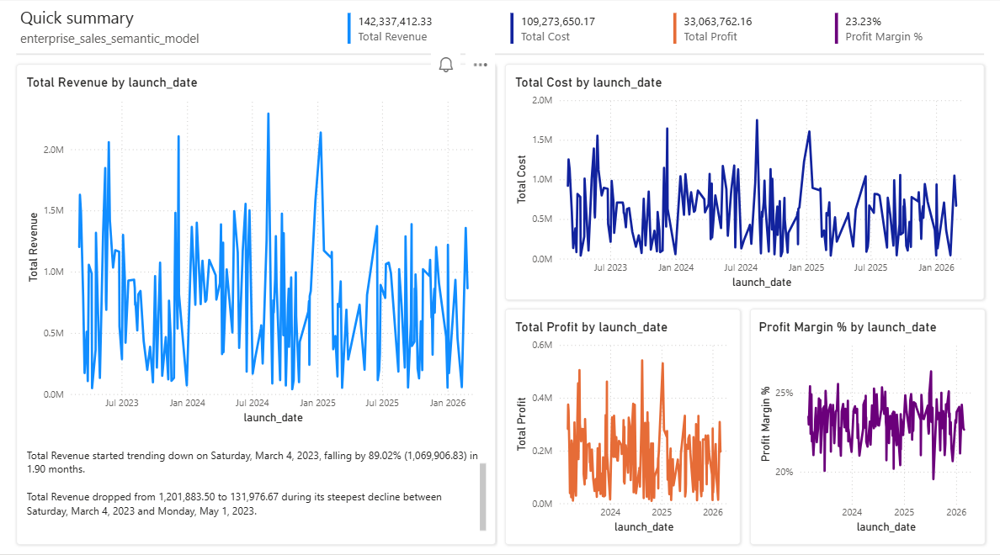
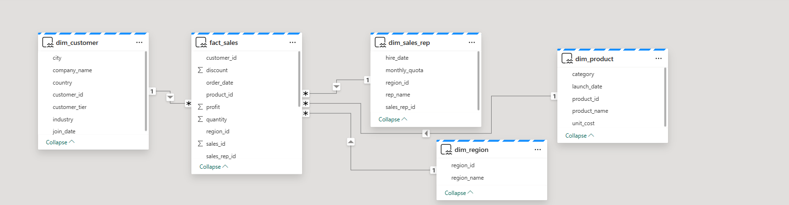

# Enterprise Sales Intelligence Platform

## 📊 Project Overview
An end-to-end enterprise analytics solution built with Microsoft Fabric, featuring star schema design, DAX measures, and an executive dashboard for B2B sales analysis. This project simulates a real-world business intelligence implementation for a global electronics distributor.



---

## 🎯 Business Scenario

### Company Profile: TechNova Distribution
| Attribute | Value |
|-----------|-------|
| **Industry** | B2B Electronics Distribution |
| **Operations** | Multi-country (5 regions) |
| **Customer Type** | Corporate clients (B2B) |
| **Customers** | 500+ businesses |
| **Products** | 200+ electronics products |
| **Sales Team** | 25 sales reps with monthly quotas |
| **Transactions** | 10,000+ sales records |

### Business Problem
The company needed a centralized view of sales performance, profitability tracking across regions, sales rep performance monitoring, customer tier analysis, and real-time KPI monitoring.

### Solution
An enterprise-grade analytics platform providing executive dashboard with key metrics, drill-down capabilities by region/product/customer, and profit margin analysis.

---

## 📈 Key Performance Indicators

| KPI | Value | Business Question |
|-----|-------|-------------------|
| **Total Revenue** | $142.3M | How much are we selling? |
| **Total Profit** | $109.3M | Are we making money? |
| **Profit Margin** | 23.23% | How efficient are we? |
| **Total Quantity** | 10,000+ | What's our sales volume? |

---

## 📊 Visual Analytics

### Revenue Trend Analysis
Tracking sales performance over time to identify patterns and seasonality.


**Key Insight:** Revenue shows seasonal patterns with peaks in Q4 and dips in Q1.

### Regional Performance
Comparing sales across different geographic regions.


**Key Insight:** North America leads in revenue (38%), followed by Europe (32%).

### Product Category Analysis
Understanding which product categories drive the most revenue.


**Key Insight:** Laptops and Servers account for 65% of total revenue.

---

## 🏗 Data Architecture (Star Schema)



### Medallion Architecture
```
Bronze Layer (Raw) → Silver Layer (Cleaned) → Gold Layer (Star Schema)
       ↓                      ↓                        ↓
    CSV Files            Delta Tables          Semantic Model
```

### Table Structure

| Table | Type | Rows | Description |
|-------|------|------|-------------|
| `fact_sales` | Fact | 10,000 | Core transaction data |
| `dim_customer` | Dimension | 500 | Customer master data |
| `dim_product` | Dimension | 200 | Product catalog |
| `dim_sales_rep` | Dimension | 25 | Sales team data |
| `dim_region` | Dimension | 5 | Geographic regions |

### Relationships
```
                    ┌─────────────────┐
                    │  dim_customer   │
                    └────────┬────────┘
                             │
┌─────────────────┐          │
│   dim_product   │          │
└─────────────────┘          │
              ┌──────────────┴──────────────┐
              │         fact_sales          │
              └──────────────┬──────────────┘
                    ┌────────┴────────┐
                    │                 │
        ┌───────────▼─────┐   ┌───────▼───────────┐
        │  dim_sales_rep   │   │    dim_region     │
        └─────────────────┘   └───────────────────┘
```

---

## 📐 DAX Measures

```dax
// Total Revenue
Total Revenue = SUM(fact_sales[total_revenue])

// Total Cost  
Total Cost = SUM(fact_sales[total_cost])

// Total Profit
Total Profit = SUM(fact_sales[profit])

// Profit Margin % (formatted as percentage)
Profit Margin % = DIVIDE([Total Profit], [Total Revenue], 0)

// Total Quantity Sold
Total Quantity = SUM(fact_sales[quantity])
```

---

## 🛠 Technologies Used

| Category | Technology | Purpose |
|----------|------------|---------|
| **Cloud Platform** | Microsoft Fabric | Unified analytics platform |
| **Storage** | Fabric Lakehouse | Data lake + warehouse |
| **Processing** | Direct Lake | In-memory analytics |
| **Modeling** | Semantic Model | Business logic layer |
| **Visualization** | Power BI | Interactive dashboards |
| **Data Generation** | Python (pandas, faker) | Synthetic data creation |
| **Version Control** | Git/GitHub | Source code management |

---

## 🚀 How to Reproduce This Project

### Prerequisites
- Microsoft Fabric trial access
- Python 3.8+ installed
- Git installed

### Step-by-Step Instructions

1. **Clone the repository**
   ```bash
   git clone https://github.com/neontechithub-progamers/enterprise-sales-intelligence.git
   cd enterprise-sales-intelligence
   ```

2. **Install Python dependencies**
   ```bash
   pip install pandas numpy faker
   ```

3. **Generate the dataset**
   ```bash
   python scripts/generate_data.py
   ```
   This creates 10,000 sales records with 5 tables in `data/raw/`

4. **Upload to Microsoft Fabric**
   - Create a Lakehouse named `enterprise_sales_lakehouse`
   - Upload CSV files to `Files/raw/`
   - Load to Tables (Delta tables)

5. **Create Semantic Model**
   - Create relationships (star schema)
   - Add DAX measures
   - Format measures appropriately

6. **Build Dashboard**
   - Create report with KPI cards
   - Add trend charts and breakdowns
   - Arrange for executive view

---

## 📁 Repository Structure

```
enterprise-sales-intelligence/
│
├── scripts/
│   └── generate_data.py          # Python data generator
│
├── docs/
│   └── images/                    # Dashboard screenshots
│       ├── dashboard_overview.png
│       └── star_schema.png
│
├── README.md                       # Project documentation
└── .gitignore                      # Git ignore rules
```

---

## 💡 Key Learnings

Through this project, I learned:

✅ **Modern Data Architecture** - Implementing medallion pattern in Microsoft Fabric

✅ **Star Schema Design** - Building fact and dimension tables with proper relationships

✅ **DAX Measures** - Creating business KPIs with proper formatting

✅ **Cloud Analytics** - Working with enterprise-grade tools

✅ **Version Control** - Professional Git workflow with meaningful commits

✅ **Documentation** - Creating portfolio-ready project documentation

---

## 🔮 Future Enhancements

- [ ] Add incremental data refresh
- [ ] Implement row-level security
- [ ] Create mobile-optimized dashboard
- [ ] Add forecast predictions using AI
- [ ] Include sales quota tracking
- [ ] Set up data alerts for executives

---

## 👨‍💻 Author

**Umer**  
Data Analytics Portfolio Project  
[GitHub Profile](https://github.com/neontechithub-progamers)

---

## 📄 License

This project is licensed under the MIT License - see the LICENSE file for details.

---

## 🙏 Acknowledgments

- Microsoft Fabric Documentation
- Power BI Community
- Python Faker Library Documentation

---

## 📬 Contact

For questions or feedback about this project, please open an issue on GitHub.

---

